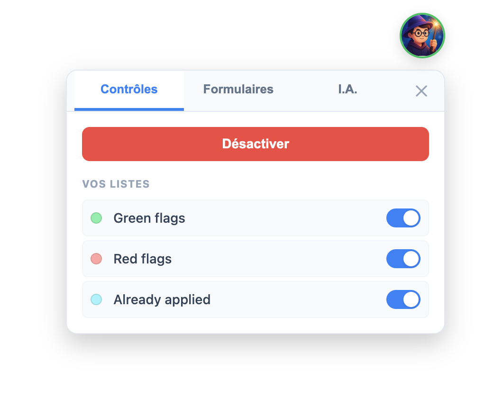

<div align="center">
  
  <h3>Spotter: Your Smart Highlighting Assistant for the Web</h3>
  <p>A discreet but powerful browser extension to automatically highlight custom keyword lists on any webpage, helping you spot what matters most.</p>
</div>

<div align="center">
  
</div>

## ✨ Core Features

- **Custom Highlighting**: Define multiple keyword lists and Spotter will automatically highlight them across any website you visit.
- **Color-Coded Lists**: Assign a unique color to each list for quick and intuitive visual identification of different term categories.
- **Dynamic Content Support**: Works seamlessly on modern Single-Page Applications (SPAs) by using a `MutationObserver` to detect and highlight content that changes without a page reload.
- **Quick-Add Context Menu**: Instantly add any selected text to one of your lists with a simple right-click, streamlining your workflow.
- **Smart & Precise Matching**: Features case/accent-insensitivity and strict word boundary matching via `TreeWalker` API to ensure accuracy and prevent partial matches (e.g., highlights "Go", but not in "MongoDb").
- **Floating UI Access**: A discreet floating button provides quick access to controls without needing to navigate to the extension toolbar.

## 🛠️ Tech Stack

- **Language**: [JavaScript (ES6)](https://developer.mozilla.org/en-US/docs/Web/JavaScript)
- **Platform**: [Chrome Extension (Manifest V3)](https://developer.chrome.com/docs/extensions/mv3/intro/)
- **Core APIs**: [Chrome Storage API](https://developer.chrome.com/docs/extensions/reference/storage/), [Shadow DOM](https://developer.mozilla.org/en-US/docs/Web/API/Web_components/Using_shadow_DOM), [TreeWalker API](https://developer.mozilla.org/en-US/docs/Web/API/TreeWalker)
- **Styling**: [CSS](https://developer.mozilla.org/en-US/docs/Web/CSS)

## 🚀 Getting Started

This project is a browser extension and does not require a build process.

### Prerequisites

You need a Chromium-based browser to run this extension.
- [Google Chrome](https://www.google.com/chrome/)
- [Brave](https://brave.com/)
- [Microsoft Edge](https://www.microsoft.com/en-us/edge)

### 1. Installation

To install the extension locally for development:

```bash
# 1. Clone the repository
git clone https://github.com/your-username/spotter.git

# 2. Navigate to your browser's extension management page
# For Chrome/Brave: chrome://extensions
# For Edge: edge://extensions

# 3. Enable "Developer mode" (usually a toggle in the top-right corner).

# 4. Click "Load unpacked" and select the cloned `spotter` directory.
```

### 2. Environment Variables

This project does not require any environment variables. All user-defined lists and settings are stored locally using the [Chrome Storage API](https://developer.chrome.com/docs/extensions/reference/storage/).

### 3. Run the Development Server

There is no development server to run. Once the extension is loaded as "unpacked," it is active.

To see your code changes, you must reload the extension from the browser's extension management page (`chrome://extensions/`).

## 📄 License

Distributed under the MIT License. See `LICENSE` for more information.